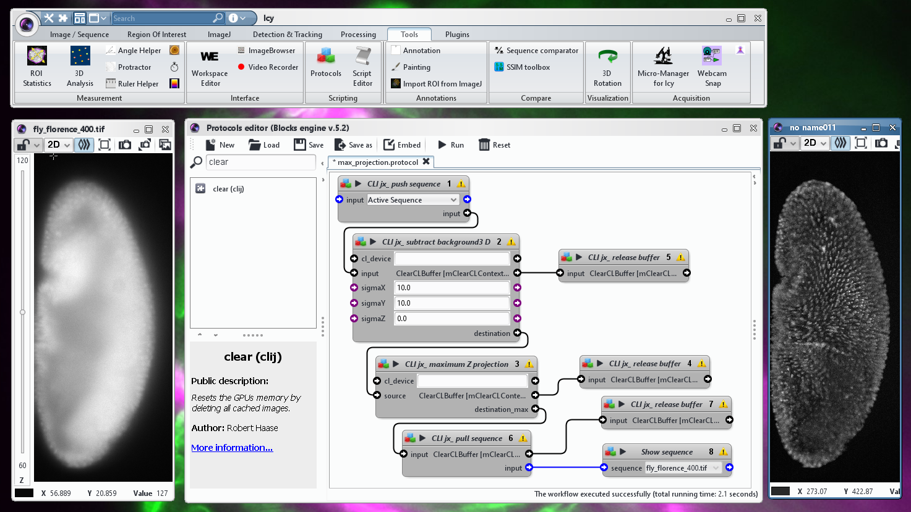

# clicy
 
clicy is a bridge between [Icy](http://icy.bioimageanalysis.org/) and [clij](https://clij.github.io/).



Right now, this is very preliminary.

## Introduction
For scripting GPU-accelerated workflows in Icy using JavaScript, you should first initalize the GPU: 

```javascript
importClass(net.haesleinhuepf.clicy.CLICY);
importClass(Packages.icy.main.Icy);

// init clicy
clijx = CLICY.getInstance();
// check which GPU we're using
print(clijx.getGPUName());
```

Then, you can push sequences to GPU memory and allocate space for more images:
```
// get current image from Icy
sequence = getSequence();

// push image to GPU
inputBuffer = clijx.pushSequence(sequence);
// allocate memory on GPU for the result
outputBuffer = clijx.create(inputBuffer);
```

You can process them using the [CLIJx API](https://clij.github.io/clij-advanced-filters/reference):
```javascript
// process image on GPU
clijx.blur(inputBuffer, outputBuffer, 5, 5);
```

Afterwards, pull the result back and show it in Icy:
```javascript
// pull result back from GPU
output = clijx.pullSequence(outputBuffer);

// Show result
Icy.addSequence(output);
```

By the end, always clean up GPU memory:
```javascript
// free memory of specific images
clijx.release(inputBuffer);

// clean up all images
clijx.clear():
```
 

## Installation
[Download Icy](http://icy.bioimageanalysis.org/download/). Enter "clicy" in Icys search field on top and click on install. Voilá. 

If you want to have the ClIcy toolbar as well, run the "InstallClicyToolbar" plugin:


Afterwards, a message should appear:


After restarting Icy, you should see the toolbar:


## Examples
Example code for Icys script editor can be found in the [javascript](https://github.com/clij/clicy/tree/master/src/main/javascript) directory. Also feel free to copy paste some code snippets from [CLIJ](https://github.com/clij/clij-docs/tree/master/src/main/jython) and [CLIJx](https://github.com/clij/clij-advanced-filters/tree/master/src/main/jython) jython examples.

## Please note
Icy support is under testing right now. Release is planned in June 2020. Please report any issues. Feedback is very welcome!
Thanks for your support!

[Back to CLIJ documentation](https://clij.github.io/)

[Imprint](https://clij.github.io/imprint)
